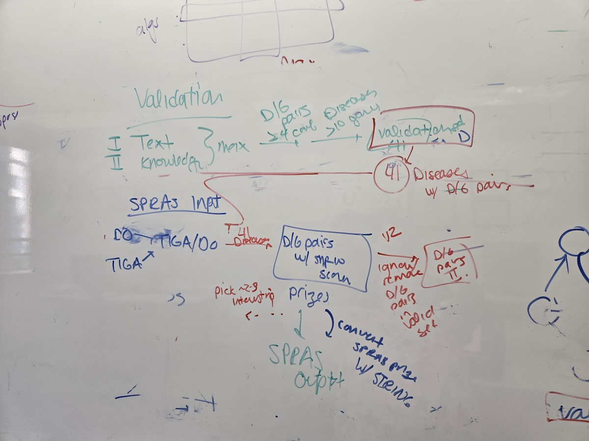

# GWAS-based Disease Gene Prediction

In this dataset collection, we identify a number of disease-related trait-gene associations from a GWAS database (TIGA). This resources is one of many resources that are integrated into the DISEASES database, which predicts disease-gene associations.

Here, we ask: **how well does GWAS data predict disease-gene associations when they are considered prize nodes within a protein interactome?**

The inputs are the GWAS trait-gene associations (TIGA) and the interactome (STRING-DB). The gold standard dataset is the DISEASES database, which uses other sources of evidence (such as co-occurrence in texts) to establish disease-gene associations.

## DISEASES Database

This dataset comes from the [DISEASES Database](https://diseases.jensenlab.org/About). Relevant papers include:
- Grissa et al., [DISEASES 2.0: a weekly updated database of disease–gene associations from text mining and data integration](https://academic.oup.com/database/article/doi/10.1093/database/baac019/6554833). DATABASE 2022.
- Pletscher-Frankild et al., [DISEASES: Text mining and data integration of disease-gene associations](https://www.sciencedirect.com/science/article/pii/S1046202314003831). Methods, 2015.

Lars Juhl Jensen's lab developed and maintains the STRING database (in collaboration with other groups). The DISEASES Database uses a scheme for scoring disease-gene associations in the same manner as the text-mining scores in STRINGv9.1.

Additionally the DISEASES Database is updated weekly, so this is great for getting relevant information but we should take care in specifying dates/times that the database was accessed.

The DISEASES Database has three channels: text mining, knowledge, and Experiments. **We only consider the Text Mining and Knowledge channels when building the gold standard to avoid overlapping data with the inputs.**

The data can be obtained from [their Downloads page](https://diseases.jensenlab.org/Downloads).

## TIGA

The most recent DISEASES paper (Grissa et al. 2022) integrates a GWAS database called Target Illumination by GWAS Analytics (TIGA), also by the Jensen lab:  
- Yang et al., [TIGA: target illumination GWAS analytics](https://academic.oup.com/bioinformatics/article/37/21/3865/6292081). Bioinformatics 2021.

TIGA calculates confidence scores for gene-trait associations across genome-wide association studies. They include both citation-based and SNP-based measures in their confidence scores (called their mean rank scores); we only take their SNP data for the inputs. These SNPs are weighted by the distance inverse exponential to handle linkage disequilibrium described in their paper (called `N_snpw`). The SNPs themselves are collected from an Ensemble pipeline - TIGA does not do any novel mapping.

The TIGA data can be obtained from [their shiny app page](https://unmtid-shinyapps.net/shiny/tiga/).

## Disease Ontology

Finally, we use the Disease Ontology to get from gene-trait associations to gene-disease associations by limiting the traits to diseases. The Disease Ontology data can be obtained from [their Downloads page](https://disease-ontology.org/downloads/).

## Putting it all together

We hashed out this pipeline on the whiteboard in July:

Briefly the steps are:

**A. Gold Standard Dataset Generation**:
- Use the text mining and knowledge channels from DISEASES.
- For every disease-gene association, get the max value from those two channels (we believe the confidence scores aren't averaged, but that would make sense - we should double-check).
- Remove all disease-gene associations that have a confidence score of less than 4 (retain all w/ scores 4 or 5 out of 5). Call these "high confidence disease-gene pairs."
- Then, remove all disease-gene associations for which there are fewer than 10 high confidence disease-gene pairs for a disease.

By our count, we have 41 diseases that pass these filters, and have 10 or more high confidence disease-gene pairs.

**B. GWAS Dataset Creation**:
- Take the TIGA trait-gene associations and the Disease Ontology (DO) annotations.
- Retain all TIGA trait-gene associations where the trait is in the disease ontology. Call these "DO-gene associations". There will be snp_w scores for every gene.
- Retain the DO-gene associations for the 41 diseases from the gold standard dataset. (We discussed a version 2 where we also run DO-gene associations for diseases _not_ in the validation set; that's a later project).

**C. SPRAS Inputs**:
- Use the STRING-DB interactome (there is a benchmark file for the DISEASES database with STRINGv9.1, but we might want to use the most recent STRING version).
- Each of the 41 diseases will be a separate node prizes dataset. For each disease, convert the snp_w scores into prizes and make a `node-prizes.txt` file.
- Each of the 41 diseases will have a validation dataset, comprising of the high confidence diseases-gene pairs from the DISEASES text mining and/or knowledge channels. They have a score (a 4 or a 5), but I assumed we would consider them all "high confidence" and thus a gene set.
