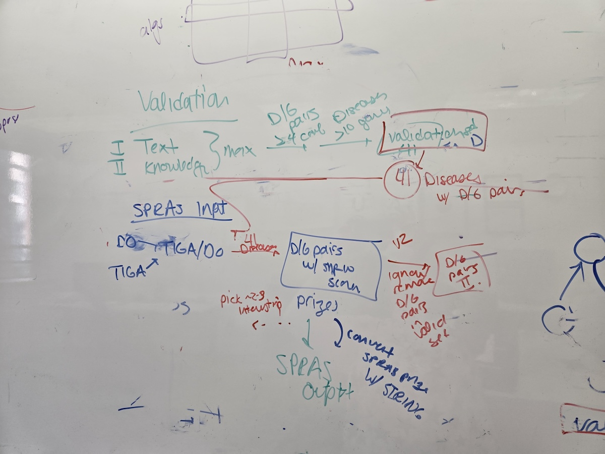
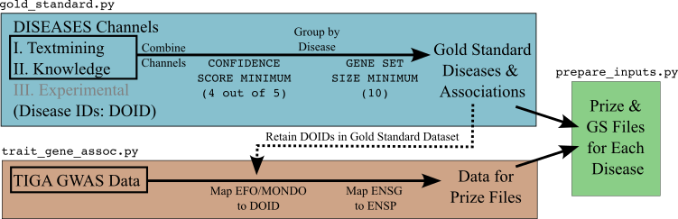

# GWAS-based Disease Gene Prediction

In this dataset collection, we identify a number of disease-related trait-gene associations from a GWAS database (TIGA). This resources is one of many resources that are integrated into the DISEASES database, which predicts disease-gene associations.

Here, we ask: **how well does GWAS data predict disease-gene associations when they are considered prize nodes within a protein interactome?**

The inputs are the GWAS trait-gene associations (TIGA) and the interactome (STRING-DB). The gold standard dataset is the DISEASES database, which uses other sources of evidence (such as co-occurrence in texts) to establish disease-gene associations.

## DISEASES Database

This dataset comes from the [DISEASES Database](https://diseases.jensenlab.org/About). Relevant papers include:
- Grissa et al., [DISEASES 2.0: a weekly updated database of disease–gene associations from text mining and data integration](https://academic.oup.com/database/article/doi/10.1093/database/baac019/6554833). DATABASE 2022.
- Pletscher-Frankild et al., [DISEASES: Text mining and data integration of disease-gene associations](https://www.sciencedirect.com/science/article/pii/S1046202314003831). Methods, 2015.

Lars Juhl Jensen's lab developed and maintains the STRING database (in collaboration with other groups). The DISEASES Database uses a scheme for scoring disease-gene associations in the same manner as the text-mining scores in STRINGv9.1.

Additionally the DISEASES Database is updated weekly, so this is great for getting relevant information but we should take care in specifying dates/times that the database was accessed.

The DISEASES Database has three channels: text mining, knowledge, and Experiments. **We only consider the Text Mining and Knowledge channels when building the gold standard to avoid overlapping data with the inputs.**

The data can be obtained from [their Downloads page](https://diseases.jensenlab.org/Downloads).

## TIGA

The most recent DISEASES paper (Grissa et al. 2022) integrates a GWAS database called Target Illumination by GWAS Analytics (TIGA), also by the Jensen lab:  
- Yang et al., [TIGA: target illumination GWAS analytics](https://academic.oup.com/bioinformatics/article/37/21/3865/6292081). Bioinformatics 2021.

TIGA calculates confidence scores for gene-trait associations across genome-wide association studies. They include both citation-based and SNP-based measures in their confidence scores (called their mean rank scores); we only take their SNP data for the inputs. These SNPs are weighted by the distance inverse exponential to handle linkage disequilibrium described in their paper (called `N_snpw`). The SNPs themselves are collected from an Ensemble pipeline - TIGA does not do any novel mapping.

The TIGA gene-trait association data can be obtained from [their shiny app page](https://unmtid-shinyapps.net/shiny/tiga/), either through
all gene-trait associations, or through their [archived files](https://unmtid-dbs.net/download/TIGA/).

## Disease Ontology

Finally, we use the Disease Ontology to get from gene-trait associations to gene-disease associations by limiting the traits to diseases. The Disease Ontology data can be obtained from [their Downloads page](https://disease-ontology.org/downloads/).

## Putting it all together

We hashed out this pipeline on the whiteboard in July 2026:



Here is an updated version after April/May 2026 refactoring:

 

Briefly the steps are:

**A. Gold Standard Dataset Generation** (`scripts/gold_standard.py`):
- Use the text mining and knowledge channels from DISEASES.
- For every disease-gene association, get the max value from those two channels (we believe the confidence scores aren't averaged, but that would make sense - we should double-check).
- Remove all disease-gene associations that have a confidence score of less than 4 (retain all w/ scores 4 or 5 out of 5). Call these "high confidence disease-gene pairs."
- Then, remove all disease-gene associations for which there are fewer than 10 high confidence disease-gene pairs for a disease.
- :TODO: should we ensure that all genes are in STRING-DB? If so, should we require that there are 10 high-confidence disease-gene pairs _in the interactome_?

```
Reading data...
 287971 text mining and 7734 knowledge associations.
 268 text mining and 7683 knowledge associations with confidenceScore >= 4.

Combining Text Mining and Knowledge Channels...
 135 associations found in both text mining and knowledge channels. Maximum score retained.
 63 associations from text mining only.
 7201 associations from knowledge only.
 7399 total high confidence disease-gene associations.

Filtering diseases...
 The high-confidence disease-gene pairs correspond to 1099 distinct diseases.
 There are 134 diseases with at least 10 high-confidence disease-gene pairs
 There are 5369 high-confidence disease-gene pairs from the 134 diseases
```

**B. GWAS Dataset Creation** (`scripts/trait_gene_assoc.py`):
- Take the TIGA trait-gene associations and the gold standard Disease Ontology (DO) annotations.
- Map the TIGA traits (in EFO/MONDO/OBA ids) to DOID. Call these "DO-gene associations". There will be snp_w scores for every gene. The mapping is done with [EBI's Ontology xRef Service (OxO)](https://www.ebi.ac.uk/spot/oxo/).
- Ensure all genes are present in the STRING interactome (map the `ENSG` ids to `ENSP` ids). We use the STRING-DB alias mapping to ensure that all TIGA trait-gene associations are in the STRING interactome. (there is a benchmark file for the DISEASES database with STRINGv9.1, but we use the most recent STRING version).

```
Reading TIGA file...
. There are 676837 trait-gene snp scores from TIGA.
. There are 11978 EFO/MONDO/OBA traits.
Reading gold standard file...
. There are 134 disease ontology IDs from the gold standard.
Querying https://www.ebi.ac.uk/spot/oxo/api/search?size=500 in batches of 20:
.  [0:20/134]
.  [20:40/134]
.  [40:60/134]
.  [60:80/134]
.  [80:100/134]
.  [100:120/134]
.  [120:140/134]
132/134 DOIDs are mapped.
41/132 of mapped DOIDs are in TIGA.
Mapping TIGA entries to DOID:
. There are 10739 trait-gene snp scores after mapping to DOID and dropping N/As.
. There are now 40 DROID traits in the TIGA dataset.
. (Note: two TIGA ids map to a single DOID)
Mapping STRING IDs:
.  There are 10715 DOID-gene snp scores.
```

_Note:_ We discussed a version 2 where we also run DO-gene associations for diseases _not_ in the validation set; that's a later project).

**C. SPRAS Inputs** (`prepare_inputs.py`):
- Identify the diseases that have both TIGA data and also appear in the Gold Standard dataset. 
- Each of the diseases will be a separate node prizes dataset. For each disease, convert the snp_w scores into prizes and make a `node-prizes.txt` file. 
- Each of the diseases will have a validation dataset, comprising of the high confidence diseases-gene pairs from the DISEASES text mining and/or knowledge channels. They have a score (a 4 or a 5), but they are all considered "high confidence" and thus a gene set. 

```
Reading gold standard and trait-gene assoc files:
.  Gold Standard: 5369 disease-gene associations for 134 diseases.
.  Trait-gene associations (TIGA): 10715 trait-gene associations for 40 diseases.
There are 40 diseases that are in both the gold standard and in TIGA.
Done writing prize and gold standard files for 40 diseases.
```
